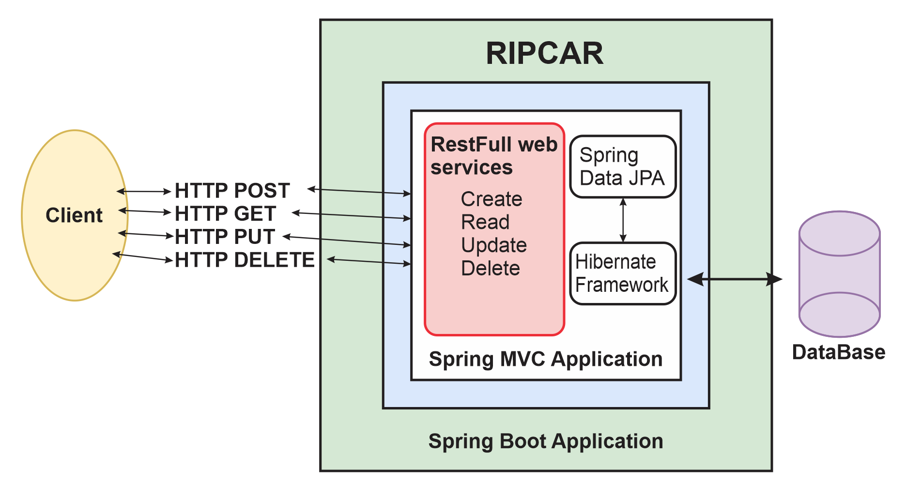

## Template-Api
Este proyecto es un template de código de implementación de servicios para el control de almacen para la empresa RIPCAR restalizado con JAVA 11.

* Importante: Esta plantilla de código es transitoria hasta que el squad de Framework libere la versión Oficial.

## Secuencia e integración
El template de código implementa integración con kafka detalle de la secuencia vizualizar el siguiente diagrama:




2. Correr los siguientes comandos: <br/>

```
mvn clean package
java -jar target/backend-ripcar.jar

```


## Estructura del proyecto

```
.
├── src
    ├── main
        ├── java
            ├── com.ripcar
                ├── controller // implementaciones de los controladores 
                ├── entitys // capa de entidades
                ├──repositories // capa repositorio 
                ├──service // capa de servicios 
    ├── test // unit tests del proyecto
├── target // dependencias y compilados
├── .gitignore
├── pom.xml
├── README.md

```